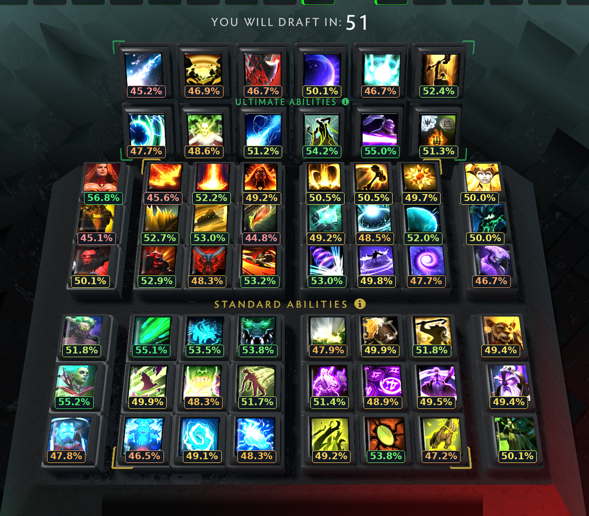
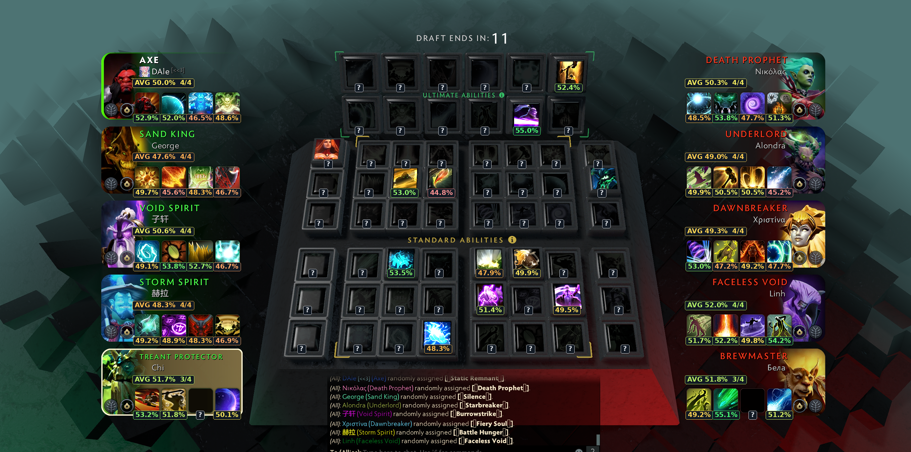

# Dota 2 Ability Draft Helper

Offline screenshot recognition for Dota 2 Ability Draft: ability and hero win rates from cached Windrun statistics, player build averages, and saved manual icon corrections. English desktop UI. Developed and tested on Linux KDE with a 5120×1440 game window.

## Screenshots

### Draft board

Win rates use a continuous scale: light red at 45% or below, orange at 48%, yellow at 50%, bright green at 55% or above. Unknown matches show `?`. This example includes manual corrections.



### Player builds

Four skill slots per player are recognized on both sides. `AVG` is the arithmetic mean of confirmed skill win rates, with coverage such as `4/4` or `3/4`. It is **not** a build's probability of winning and does not model synergy. Incomplete averages are not directly comparable to complete builds.



## Run

Requires Python, Tkinter, NumPy and Pillow (see `requirements.txt`). Install dependencies in your preferred Python environment, then run:

```sh
./start.sh
```

The launcher uses an existing bundled Python runtime when available, otherwise `python3`. It does not install dependencies. The window opens maximized.

- **Open screenshot**: open a full game screenshot.
- Click an icon, select its name, then **Choose and save**. The correction is saved immediately in `data/learned-icons/corrections.json`; closing the app needs no extra save step.
- **Save PNG**: export the annotated image.
- **Keep ?**: mark the current result uncertain; this does not delete a previously saved correction.

Saved corrections contain small icon pixel samples, not full screenshots. Their reuse depends on visual similarity and recognition confidence.

## KDE shortcut

Requires KDE Spectacle, `gdbus`, and `desktop-file-validate`:

```sh
python3 scripts/install_shortcut.py
```

Press **Meta+F8 while Dota is active**. Spectacle captures the active window and opens a new helper window. Both the central board and player builds are analyzed. A full local capture remains in ignored `state/full-capture.png`. No screenshots are uploaded during normal use.

## Screen compatibility

- **5120×1440:** tested with the demonstrated Dota draft UI.
- Full reference screenshots around **2:1**: supported by the original layout.
- Other resolutions with the **same UI proportions**: coordinates scale, but recognition can vary with image size and sharpness.
- **1920×1080, 2560×1440 (16:9), 3440×1440 (21:9): not currently supported/validated** by the input geometry checks. They require separate layout calibration, not merely resizing the screenshot.
- A specific cropped review layout is also supported; arbitrary crops, HUD scales and UI changes are not.

The tool is experimental. Check uncertain or surprising matches by clicking the icon. No live overlay or periodic capture is implemented.

## Data and backups

Statistics are a cached Windrun **7.41d** snapshot; updates are manual. Normal recognition works offline. Ability icons come from Valve's Dota image CDN. Dota 2 and its artwork belong to Valve; this is an unofficial community project.

- [Windrun statistics](https://windrun.io/abilities)
- [Valve image CDN](https://cdn.cloudflare.steamstatic.com/apps/dota2/images/dota_react/)

The Git tag `stable-working-2026-09-08-2c39ee0` preserves the first user-confirmed working ultrawide version before subsequent additions.

Focused build-average checks:

```sh
python3 -m unittest discover -s tests -p test_builds.py -v
```

Older `test_core.py` and `gui_smoke.py` describe the pre-rollback API and need migration before the complete historical test suite can be used.
