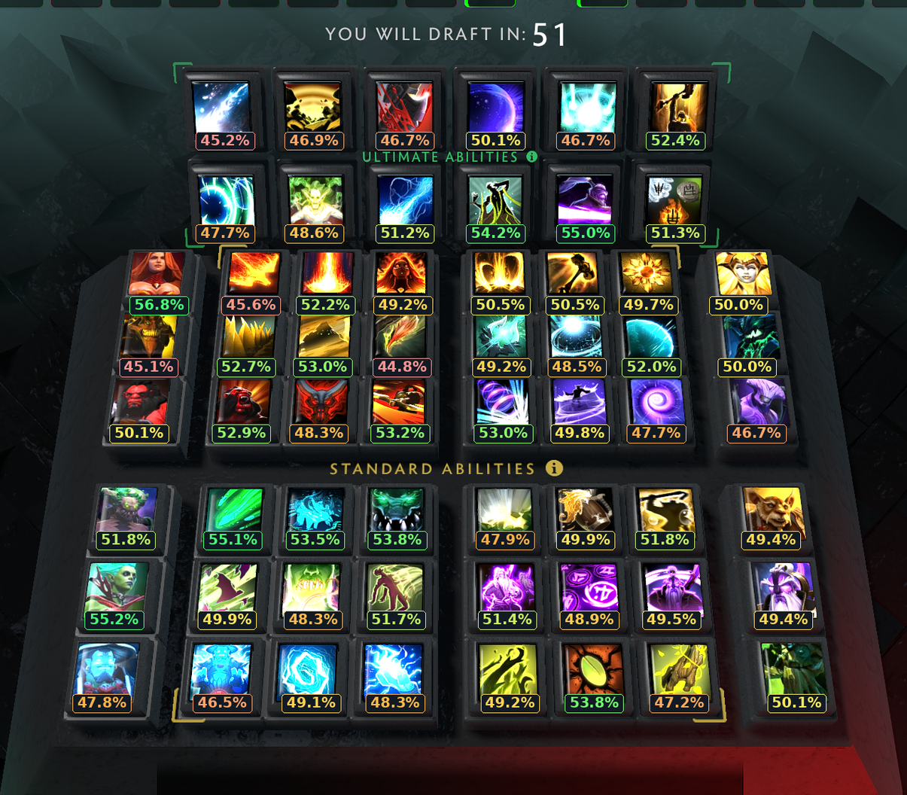
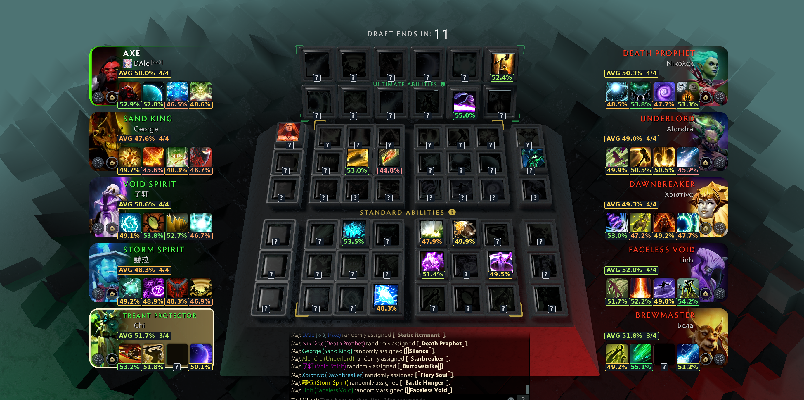

# Dota 2 Ability Draft Helper

Dota 2 Ability Draft helper with screenshot recognition, a live win-rate overlay, and optional auto accept. Uses cached Windrun statistics for abilities and heroes, shows player build averages, and remembers manual icon corrections. English desktop UI. Developed and tested on Linux KDE with a 5120×1440 game window.

## Main shortcuts

- **Win+F8** — capture the draft and open or update the screenshot helper.
- **Win+F9** — toggle the click-through win-rate overlay; updates every 7 seconds for 7 minutes 15 seconds.
- **Win+F10** — toggle auto accept: checks for the Ability Draft acceptance dialog every 5 seconds and presses Enter. Keeps waiting if other players fail to accept, then automatically starts the overlay when the draft is detected. Dota must remain active.

See the setup and requirements for each mode below.

## Screenshots

### Draft board

Win rates use a continuous scale: light red at 45% or below, orange at 48%, yellow at 50%, bright green at 55% or above. Unknown matches show `?`. This example includes manual corrections.



### Player builds

Four skill slots per player are recognized on both sides. `AVG` is the arithmetic mean of confirmed skill win rates, with coverage such as `4/4` or `3/4`. It is **not** a build's probability of winning and does not model synergy. Incomplete averages are not directly comparable to complete builds.



## Run

Requires Python, Tkinter, NumPy and Pillow (see `requirements.txt`). Install dependencies in your preferred Python environment, then run:

```sh
./start.sh
```

The launcher uses an existing bundled Python runtime when available, otherwise `python3`. It does not install dependencies. The window opens maximized.

- **Open screenshot**: open a full game screenshot.
- Click an icon, select its name, then **Choose and save**. The correction is saved immediately in `data/learned-icons/corrections.json`; closing the app needs no extra save step.
- **Save PNG**: export the annotated image.
- **Keep ?**: mark the current result uncertain; this does not delete a previously saved correction.

Saved corrections contain small icon pixel samples, not full screenshots. Their reuse depends on visual similarity and recognition confidence.

## KDE shortcut

Requires KDE Spectacle, `gdbus`, and `desktop-file-validate`:

```sh
python3 scripts/install_shortcut.py
```

Press **Meta+F8 while Dota is active**. Spectacle captures the active window and updates the existing helper window, or opens one if it is not running. Both the central board and player builds are analyzed. A pending capture waits while recognition or manual icon selection is active; the latest capture wins. Close any windows from older versions once after upgrading. A full local capture remains in ignored `state/full-capture.png`. No screenshots are uploaded during normal use.

## Screen compatibility

- **5120×1440:** tested with the demonstrated Dota draft UI.
- Full reference screenshots around **2:1**: supported by the original layout.
- Other resolutions with the **same UI proportions**: coordinates scale, but recognition can vary with image size and sharpness.
- **1920×1080, 2560×1440 (16:9), 3440×1440 (21:9): not currently supported/validated** by the input geometry checks. They require separate layout calibration, not merely resizing the screenshot.
- A specific cropped review layout is also supported; arbitrary crops, HUD scales and UI changes are not.

The tool is experimental. Check uncertain or surprising matches by clicking the icon. An optional experimental overlay is described below.

## Data and backups

Statistics are a cached Windrun **7.41d** snapshot; updates are manual. Normal recognition works offline. Ability icons come from Valve's Dota image CDN. Dota 2 and its artwork belong to Valve; this is an unofficial community project.

- [Windrun statistics](https://windrun.io/abilities)
- [Valve image CDN](https://cdn.cloudflare.steamstatic.com/apps/dota2/images/dota_react/)

The Git tag `stable-working-2026-09-08-2c39ee0` preserves the first user-confirmed working ultrawide version before subsequent additions.

Focused build-average checks:

```sh
python3 -m unittest discover -s tests -p test_builds.py -v
```

Older `test_core.py` and `gui_smoke.py` describe the pre-rollback API and need migration before the complete historical test suite can be used.

## Experimental overlay (KDE / XWayland, 5120×1440)

Press **Meta+F9** to start a 435-second (7m15s) overlay session; press it again to stop. Alternatively use **Start overlay** in the screenshot helper, then return to Dota. Install the optional shortcut with `python3 scripts/install_overlay_shortcut.py`. The separate overlay process updates every 7 seconds while the Dota window is active. **Stop overlay** in the helper or the tray menu stops it; the tray also offers Pause.

- Only confirmed percentages are drawn. No `?`, frames, averages or editing controls are drawn over the game. Correct names in screenshot mode.
- The transparent window does not accept input or keyboard focus. It hides when Dota loses focus ; previous percentages remain visible during capture and recognition, then update together. A shared capture lock prevents clashes with Meta+F8.
- Coordinates are obtained by reversing the existing ultrawide screenshot crop, then mapping physical capture pixels to the Dota client rectangle reported by KWin, using the named output to translate into Qt's monitor coordinates at fractional scaling. The screenshot grid and recognizer are unchanged.
- A draft-bracket image check suppresses labels on other game screens. This is heuristic, not game-state integration.
- Requires system Python with PyQt6 and QtDBus, KDE KWin scripting, XWayland, and Spectacle. Recognition runs in the same Python runtime as the screenshot helper. No packages or persistent KWin settings are installed. The temporary read-only observer is unloaded when the overlay exits.
- Current calibration is **32:9 / 5120×1440**. Fullscreen stacking, mixed monitor scaling and physical click-through still need confirmation in the user's live game; this is an experimental mode, not a replacement for screenshots.

Implementation references: [Qt input-transparent window flags](https://doc.qt.io/qt-6/qt.html#WindowType-enum), [KWin scripting API](https://develop.kde.org/docs/plasma/kwin/api/).

## Auto accept → draft overlay (Win / Meta + F10)

Press **Win+F10** once after starting matchmaking; press it again to cancel.
Keep Dota active. Every 5 seconds, a separate process captures the active Dota
window and looks for the English **ACCEPT** button, its green background and the
**ABILITY DRAFT / READY** heading. It sends **Enter**, without moving the mouse.
It continues waiting if other players fail to accept and matchmaking resumes.

After two consecutive draft-board detections, auto accept stops and starts (or
rearms) the existing 435-second overlay session. **Win+F9** still controls the
overlay and **Win+F8** still captures screenshots. The tray menu can stop auto
accept too. No accept action is sent if Dota loses focus, the frame becomes stale,
or modifier keys are held. It does not start matchmaking or operate in the
background while another app is active.

Install the optional shortcut: `python3 scripts/install_autoaccept_shortcut.py`.
It requires the existing system Tesseract with English data, PyQt6, X11/XTest,
Spectacle and KDE. The installer refuses occupied shortcuts; on the development
machine Meta+F10 was reassigned from KDE's overview, preserving its other keys.
No system packages are installed by this feature.

Validation: the supplied 5120×1388 accept screenshot, synthetic OCR rejection
cases, repeat/transition state tests, and Enter delivery to a separate XWayland
test window. End-to-end acceptance in a live queue still needs confirmation.

### In-game hero portraits

Hero matching also uses 126 labelled portrait crops from the supplied hero-selection
screenshot (2026-09-28). The manifest is `data/hero-portraits.json`; only portrait
crops, not the full screenshot, are included. Several crops of each portrait are
compared to account for framing. Alternative appearances are grouped by hero ID
before calculating confidence. Win rates still come from the existing local
Windrun snapshot; this change does not refresh statistics.

On twelve separate draft-icon crops, nine pass the existing confidence threshold
without learned corrections (previous official portraits: zero on these crops).
All twelve top candidates are correct; Bristleback, Rubick and Lion still require
manual confirmation in this fixture. Screenshot-mode corrections continue to save
automatically. Ability templates, capture coordinates and the grid are unchanged.
